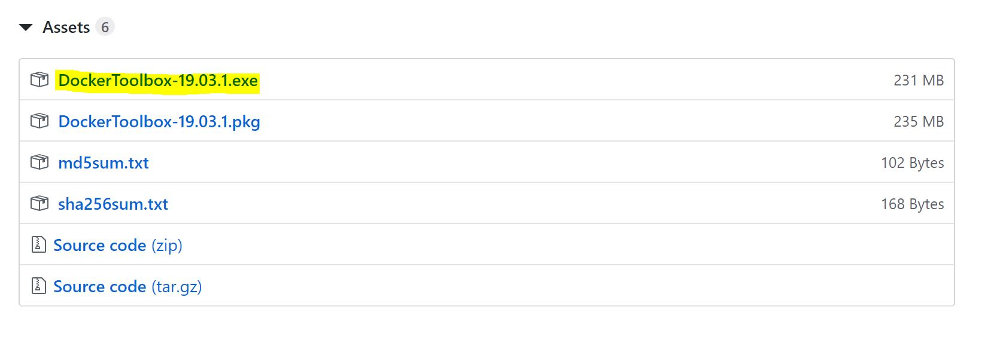

# particula-docker-compose

# Particula UML


# TODO 

Issues on Redmine.

# TUTORIAL

## What is Docker?

Docker contains your code.

The Docker files in the frontend & backend project are the building blocks for the `docker-compose`.

With `docker-compose` we load the Docker files, which installs the required packages & services we need to run the code.

## Installing Docker

### On linux

```
sudo apt-get install docker
sudo apt-get install docker-compose
```

### On Windows

You need to get the docker toolbox. `https://github.com/docker/toolbox/releases`

Get the latest `.exe` version for the toolbox.



You can run the `Docker Quickstart Terminal` to use the Docker environment.


Run the terminal and wait a couple of moments until the terminal is open and active. You will get a `machine IP`.


This IP is very important to connect to your local containers.

## Important Commands:


## To Run file
### On Linux
```
sudo docker-compose up -d --build
```

### On Windows
In Docker Quickstart Terminal:
```
docker-compose up -d --build
```

# Connecting to the services

## On Linux

### For Back-end
In your browser, go to : `localhost:3000`

### For Grafana
In your browser, go to : `localhost:3001`

### For InfluxDB
In your browser, go to : `localhost:8086`

### For Front-end
In your browser, go to : `localhost:8080`


## On Windows

Check your Docker_Toolbox machine IP and in your browser go to: `machineip:port`

### For Back-end
In your browser, go to : `machineip:3000`

### For Grafana
In your browser, go to : `machineip:3001`

### For InfluxDB
In your browser, go to : `machineip:8086`

### For Front-end
In your browser, go to : `machineip:8080`

# InfluxDB

`https://docs.influxdata.com/influxdb/v1.7/tools/api/`

## Sending data with Postman

To push data to `particulaInfluxDB` with postman create following POST request:

```
POST http://localhost:8086/write?db=particulaInfluxDB&precision=s
```

body

```
sensors,sensor_id="sensor_01",location="lab2.80" temp=21.5 1581880318
```

## Viewing data with Postman

Following is an example to view all data within `sensors`:

```
GET http://localhost:8086/query?db=particulaInfluxDB&q=select * from sensors
```

## Clearing series
To remove all data in a measurement execute following query:
```
DROP SERIES FROM sensors
```