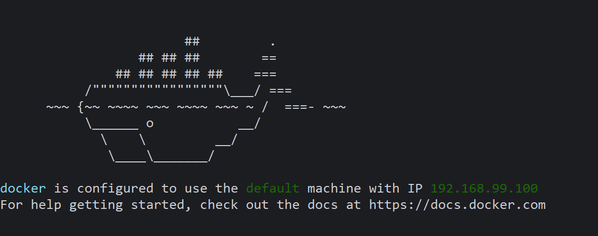
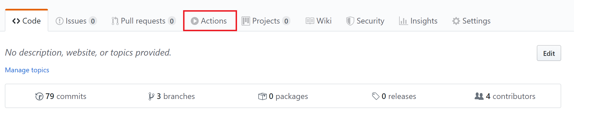
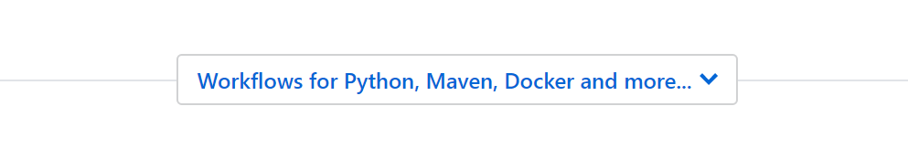

# Particula Docker Compose

## UML diagram


## Docker and Docker Compose introduction

### What is Docker

Docker contains your code.

The Docker files in the frontend & backend project are
the building blocks for the `docker-compose`.

With `docker-compose` we load the Docker files, which installs
the required packages & services we need to run the code.

### Installing Docker

#### Installation on Linux

```bash
sudo apt-get install docker
sudo apt-get install docker-compose
```

#### Installation on Windows

You need to get the docker toolbox. `https://github.com/docker/toolbox/releases`

Get the latest `.exe` version for the toolbox.


You can run the `Docker Quickstart Terminal` to use the Docker environment.


Run the terminal and wait a couple of moments until the
terminal is open and active. You will get a `machine IP`.



This IP is very important to connect to your local containers.
-> More about this later

### Important commands

#### Running the docker-compose file

##### Run on Linux

Unless you are in the docker users group you will have to use sudo.

```bash
sudo docker-compose up -d --build
```

##### Run on Windows

In Docker Quickstart Terminal:

```bash
docker-compose up -d --build
```

#### Check running containers

```bash
docker ps
```

#### Killing containers

```bash
docker kill
```

You can use this command to kill 1 container that you
select by selecting `container name or container id`

Example:

```bash
docker kill particula-docker-compose_frontend_1
```

#### Killing all containers

```bash
docker kill $(docker ps -q)
```

### Connecting to the services

#### Connecting to Backend on Linux

In your browser, go to : `localhost/<route>`

#### Connecting to Grafana on Linux

In your browser, go to : `grafana.localhost`

#### Connecting to Front-end on Linux

In your browser, go to : `localhost`

#### Connecting to services on Windows

Check your Docker_Toolbox machine IP and in your browser go to: `machineip:port`

##### Connecting to Backend on Windows

In your browser, go to : `machineip/<route>`

##### Connecting to Grafana on Windows

In your browser, go to : `grafana.machineip`

##### Connecting to Front-end on Windows

In your browser, go to : `machineip`

## InfluxDB

`https://docs.influxdata.com/influxdb/v1.7/tools/api/`

### Sending data with Postman

To push data to `particulaInfluxDB` with postman create following POST request:

```http
POST http://localhost:8086/write?db=particulaInfluxDB&precision=s
```

body

```markdown
sensors,sensor_id=sensor-test humidity=59,pm10=23,pm25=12,temperature=21.5 1581880318
```

### Viewing data with Postman

In case the port is left unchanged (can be checked with docker ps)
following is an example to view all data within `sensors`:

```http
GET http://localhost:8086/query?db=particulaInfluxDB&q=select * from sensors
```

### Clearing series

To remove all data in a measurement execute following query:

```sql
DROP SERIES FROM sensors
```

## Environment variables

For this project quite a few environment variables are used in a `.env` file. The first ones being for setting the domain name which is set to `localhost` by default. Followed by the branch you want to use to quickly switch between `master` and `develop`.

```bash
DOMAIN=localhost
BRANCH=
BRANCH_LORAWAN=
```

Next are the variables used for connecting to The Things Network and the IP of our MQTT Broker.

```bash
APP_ID=
ACCESSKEY=
REAL_TIME_IP=
```

After that you will need to configure the InfluxDB, this is where the sensordata is being send to.

```bash
INFLUX_IP=
INFLUX_PORT=
INFLUX_DB_NAME=
```

A Grafana container is used to have a quick overview of the sensors and their data.
Sinc this is configured on a subdomain you will need to set a `ROOT_URL` and
the `SUB_PATH` it will be served at. Also the admin user can be preconfigured.

```bash
GF_SERVER_ROOT_URL=
GF_SECURITY_ADMIN_USER=
GF_SECURITY_ADMIN_PASSWORD=
GF_SERVER_SERVE_FROM_SUB_PATH=
```

Next is the MySQL container which stores information about `users` and `sensors`.

```bash
MYSQL_ROOT_PASSWORD=
MYSQL_DRIVER=
MYSQL_HOST=
MYSQL_DATABASE=
MYSQL_USER=
MYSQL_PASSWORD=
```

At last there is a `authentication-api` for creating and authenticating users which requires one variable to be set.

```bash
ASPNETCORE_URLS=
```

## Docker Image on the Server

You want to create an image through Github Actions.






See the .github folder in the project for an example.

Make sure `pass` is installed on the server before
adding your personal github tokens to the server.

Now you want to create a personal github token to
load repositories on your server.

Run this command on your server:

```bash
 docker login -u USERNAME docker.pkg.github.com
 -> ACCESTOKEN
```
